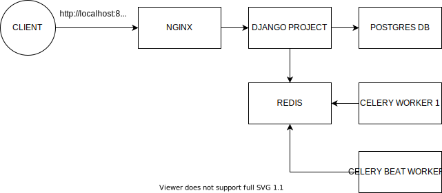

# django-docker-template

## docker setup for local development

- supports sqlite3 and postgres for db (db can be a docker service)
- supports static and media files serving

## docker setup for production

- nginx for proxying requests to application server, and serving static and media files
- application server (a.k.a django project) is run by **gunicorn**
- application server is connected to a separate db service

```yml
version: "3.7"

services:
  nginx:
    build: ./nginx-proxy
    volumes:
      - static_volume:/app/staticfiles
      - media_volume:/app/media
    ports:
      - 81:80
    depends_on:
      - web
    restart: on-failure:5
  web:
    build:
      context: ./web-project
      dockerfile: Dockerfile.prod
    volumes:
      - static_volume:/app/staticfiles
      - media_volume:/app/media
    expose:
      - 8000
    env_file:
      - .env.prod
    depends_on:
      - db
  db:
    build:
      context: ./postgres-db
    volumes:
      - postgres_data:/var/lib/postgresql/data
    env_file:
      - .env.prod

  worker:
    build:
      context: ./web-project
      dockerfile: Dockerfile.worker
    command: celery worker --app=django_project --loglevel=info --logfile=celery.log
    env_file:
      - .env.prod
    depends_on:
      - web
      - redis

  worker-celery-beat:
    build:
      context: ./web-project
      dockerfile: Dockerfile.worker
    command: celery worker --app=django_project -B --loglevel=info --logfile=celery.log
    env_file:
      - .env.prod
    depends_on:
      - web
      - redis

  redis:
    build: ./redis

volumes:
  postgres_data:
  static_volume:
  media_volume:
```

## Commands

```shell

# for development localhost:8000
docker-compose up --build -d

# for production localhost:81
docker-compose -f docker-compose-prod.yml up --build -d


```

## Architecture



## TODO

- [ ] figure out how to add SSL for nginx
